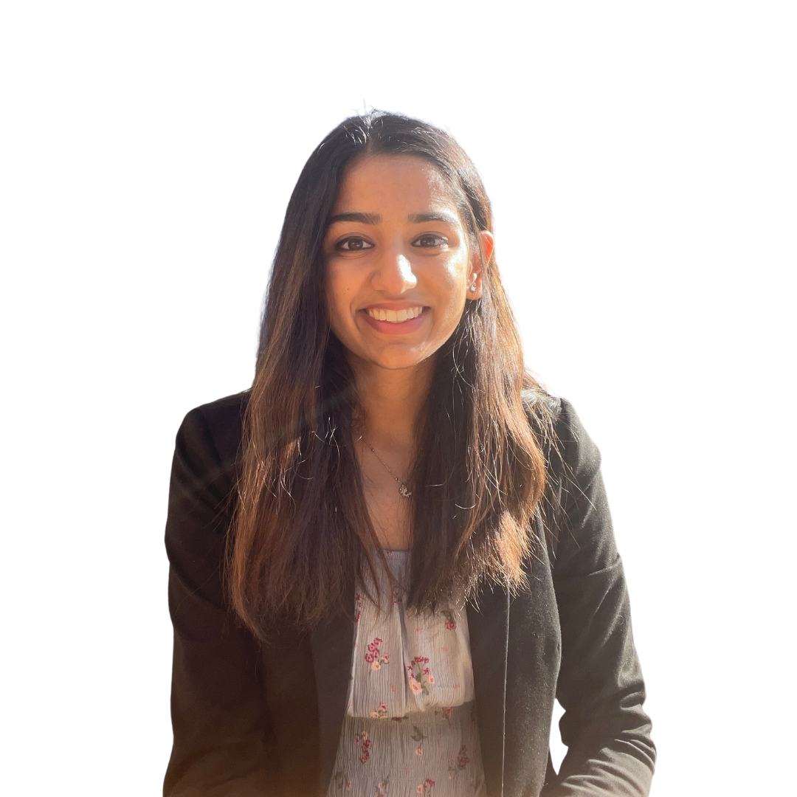
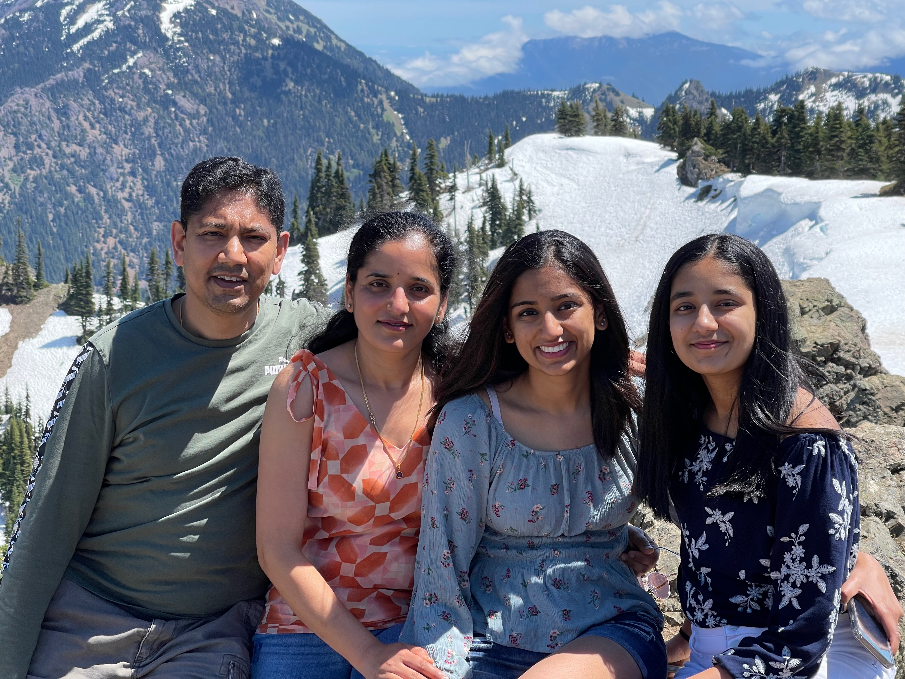
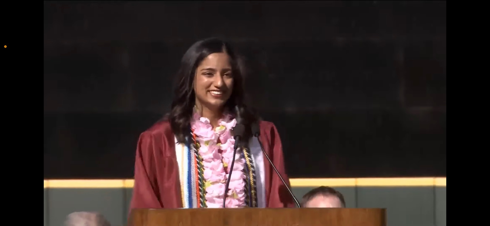
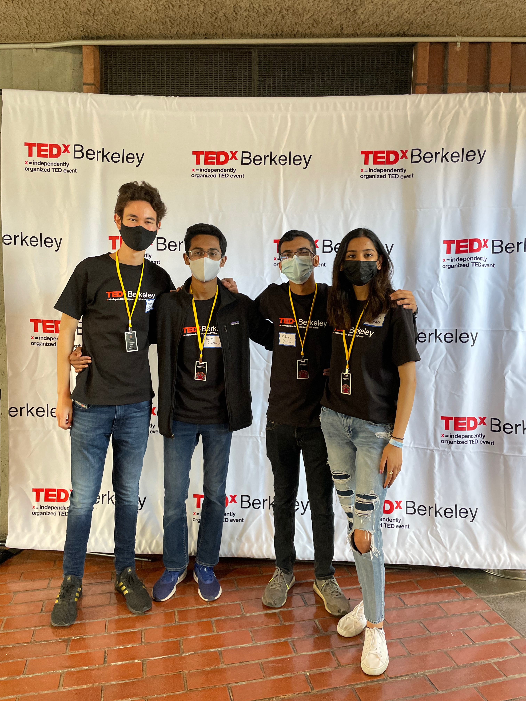
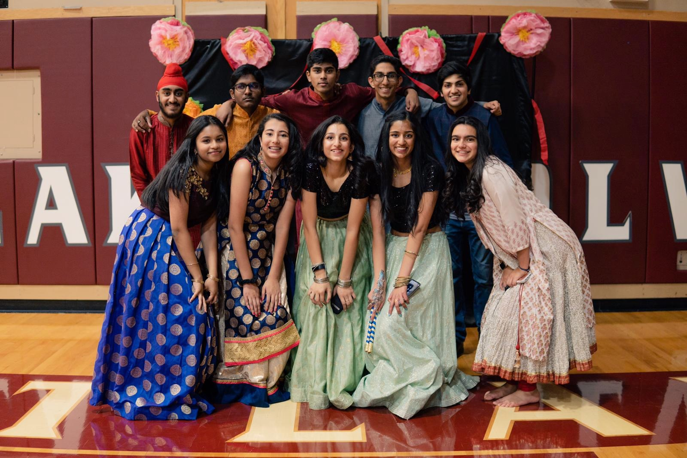
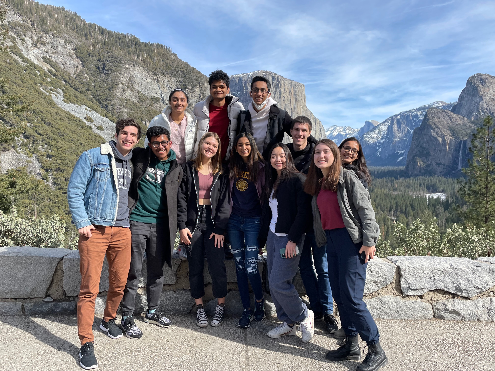
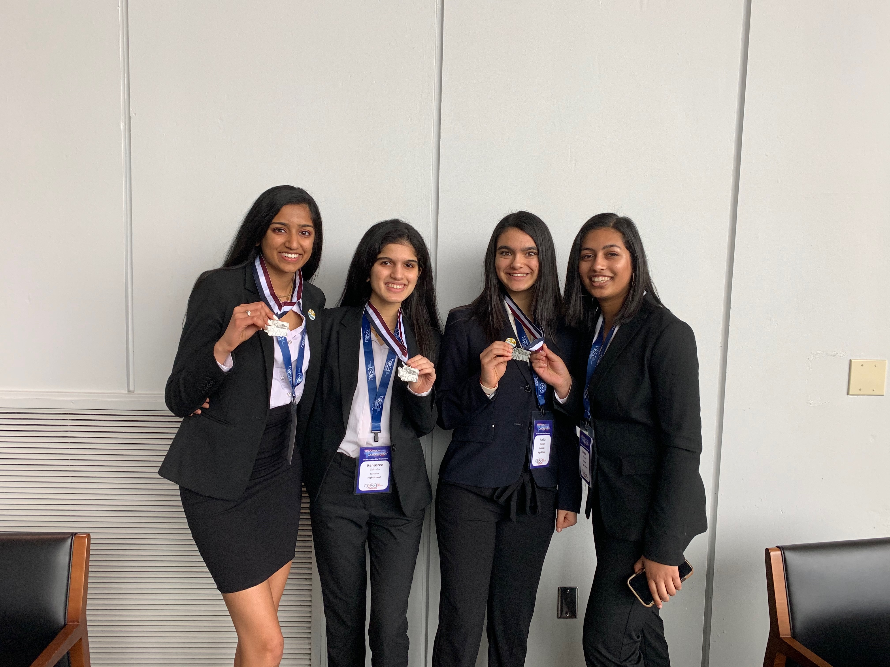

## Welcome!

 

Hi, I'm Ayushi! I'm a student in the **[Management, Entrepreneurship, and Technology (M.E.T.) Program](https://met.berkeley.edu/)** at the University of California, Berkeley, where I'm pursuing a dual degree in EECS (Electrical Engineering & Computer Sciences) and Business from the Haas School of Business. 

I'm a **builder** 🔨. In the past, I've started a [dance company](/hobbies/hobbies.md#dance), created a simulation to educate 2.5M+ youth about racial inequities in medicine, and won national hackathons. Now, I'm building **software solutions to drive humanity forward**. 

I'm currently working at the **intersection of computer science 💻 and medicine 🧬**, using machine learning as a tool to advance public health efforts. I'm leading machine learning development at a Berkeley SkyDeck-backed health-tech startup, working on integrating real-time climate and weather data with individual health data. My technical interests lie in **machine learning and full-stack development ⚙️**. As a software engineering intern at Dell Technologies, I've gained practical experience creating enterprise-grade SaaS products. 

I'm also passionate about **teaching** ✏️, and I'm actively working on a course that covers practical use-cases for essential software engineering tools, including Git, Vim, APIs, Docker, and Kubernetes. This course, titled yeSWEcan, will be offered to UC Berkeley students in the fall semester, and course resources will be posted online. Previously, I created curriculum to teach Java and Python and a publicly-available course for [Algebra 1](https://www.youtube.com/playlist?list=PLQnWUQwAahy-U6dj1v8mt4PkccYbA0s_5).

Beyond academics, I love to explore the outdoors and enjoy hiking 🌿. Some of my favorite hikes are in my home state of Washington, including the Snow Lake Trail and Hurricane Hill via Hurricane Ridge. I enjoy reading and watching historical accounts and (auto)biographies in my free time. Some of my favorite books are *The Unwinding of the Miracle* by Julie Yip-Williams and *The Beekeeper of Aleppo* by Christi Lefteri.

You can find out more about what I work on on my website. If you find something that interests you or if you have any book recommendations, please feel free to reach out to me [ayushi.batwara@berkeley.edu](mailto:ayushi.batwara@berkeley.edu).

  

## Videos

    

        

        <iframe src="https://www.youtube.com/embed/88v7_fhqJdY" 
                style="position: absolute;
                        top: 0;
                        left: 0;
                        width: 100%;
                        height: 100%;
                        border: 0;" 
                allowfullscreen></iframe>
        
  
        

        
  
 Eastlake High School Graduation Speech  
 

        This speech holds a very special place in my heart. It was a reflection of how much I had grown after moving states in the middle of high school. Albeit the rough transition, the support from my family, friends, and teachers gave me the strength to push beyond my comfort zone, create new opportunities, and help my school and community at large.
        
        

    

    

        

        <iframe src="https://www.youtube.com/embed/9ZtORCOIV6I" 
                style="position: absolute;
                        top: 0;
                        left: 0;
                        width: 100%;
                        height: 100%;
                        border: 0;" 
                allowfullscreen></iframe>
        

        

        
  
 Day in the Life of an ISB Intern  
 

        
Interning at the Institute for Systems Biology in high school was my first experience into melding my passions of computer science and biology in my <a href="https://baliga.systemsbiology.net/see-interns/hs2020/"> project</a>. I had the incredible opportunity to meet Systems Biology and P4 Medicine pioneer Leroy Hood, who inspired me to further pursue the intersection of CS and medicine.

        
        

    

    

        

        <iframe src="https://www.youtube.com/embed/b8rzTmAygfc" 
                style="position: absolute;
                        top: 0;
                        left: 0;
                        width: 100%;
                        height: 100%;
                        border: 0;" 
                allowfullscreen></iframe>
        

        

        
  
 Washington HOSA State Officer Farewell Speech  
 

        
Whether it be diving deeper into the human anatomy and disease progression or orchestrating a state conference, I discovered new facets of my strengths and interests through HOSA-Future Health Professionals.

        
        

    

  

<!-- ## Photos

    

         
         
        
    

    

         
        
    

    

         
         
    

 -->
